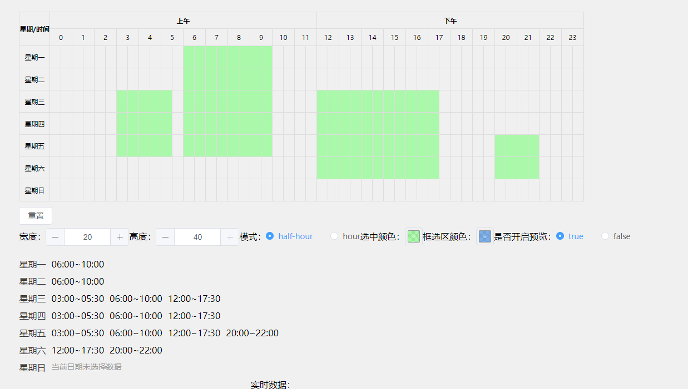

# vue-schedule-picker

> A schedule picker component for vue3.
Time period selection supports forward and backward selection, and supports range selection，

- [vue-schedule-picker](#vue-schedule-picker)
  - [How to use](#how-to-use)
  - [Props](#props)
  - [slot](#slot)
  - [FAQ](#faq)

## demo

preview：[demo url](https://wanghangit.github.io/vue-schedule-picker/index.html)

## How to use

npm install vue-schedule-picker

```html
<template>
  <Schedule :time-bucket="data" :@change-time-bucket="changeTimeBucket" />
</template>
<script lang="ts" setup>
import { ref } from 'vue';
import Schedule, { generateSelectedTime } from '../../vue-schedule-picker/src/index';

const data = ref(generateSelectedTime());
const changeTimeBucket = (index: number, value: ITime) => {
  data.value[index] = value;
}
</script>
```

## Props
<details>
<summary>time-bucket</summary>
  <table>
    <thead>
      <tr>
          <th>Name</th>
          <th>Type</th>
          <th>Default</th>
          <th>Description</th>
      </tr>
    </thead>
    <tbody>
      <tr>
        <td><code>width</code></td>
        <td>number</td>
        <td>20</td>
        <td>The width of the table td</td>
      </tr>
      <tr>
        <td><code>height</code></td>
        <td>number</td>
        <td>40</td>
        <td>The height of the table td</td>
      </tr>
      <tr>
        <td><code>activeColor</code></td>
        <td>string</td>
        <td>rgba(48, 130, 224, 0.6)</td>
        <td>The active color of the table td</td>
      </tr>
      <tr>
        <td><code>rangeColor</code></td>
        <td>string</td>
        <td>rgba(100, 255, 100, 0.5)</td>
        <td>The color of the selection range</td>
      </tr>
      <tr>
        <td><code>mode</code></td>
        <td>'hour' | 'half-hour'</td>
        <td>'half-hour'</td>
        <td>The mode of picker use to set unit of time period</td>
      </tr>
      <tr>
        <td><code>emptyText</code></td>
        <td>string</td>
        <td>当前日期未选择数据</td>
        <td>Preview component text when no data has selected</td>
      </tr>
      <tr>
        <td><code>showPreview</code></td>
        <td>boolean</td>
        <td>true</td>
        <td>The flag decide show Preview component</td>
      </tr>
    </tbody>
  </table>
</details>

## slot
only one slot is supported, use it to customize feature of picker.

```html
<Schedule>
  <!--slot content-->
  <div>
      <button>reset</button>
  </div>
</Schedule>
```


